"# django-ecommerce-project-amazon-clone" 

## Complete Playlist Tutorial Link : 

<a href="https://www.youtube.com/playlist?list=PLb-NlfexLTk9_nyBt3ZlNTp5ek8CPavRE">https://www.youtube.com/playlist?list=PLb-NlfexLTk9_nyBt3ZlNTp5ek8CPavRE</a>

## Theme Used
<a href="https://github.com/stisla/stisla">View</a>

## Er Diagram of Project
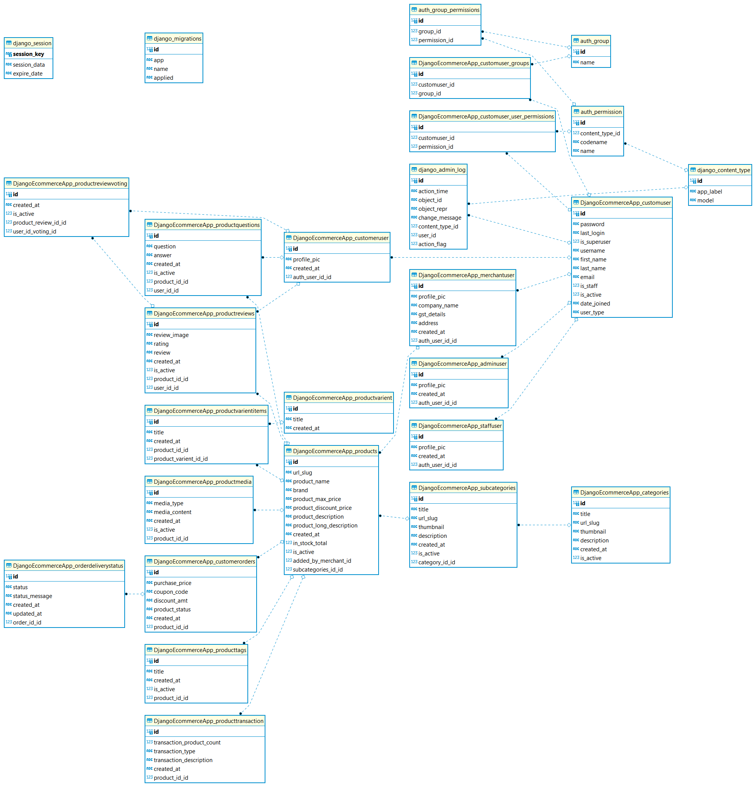

## Added BASE TEMPLATE Page
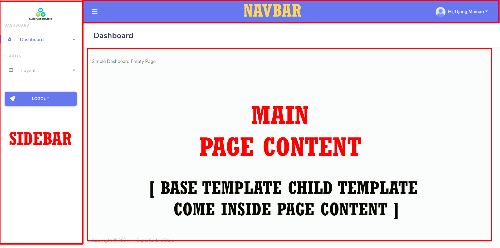

## Added Admin Signin Page
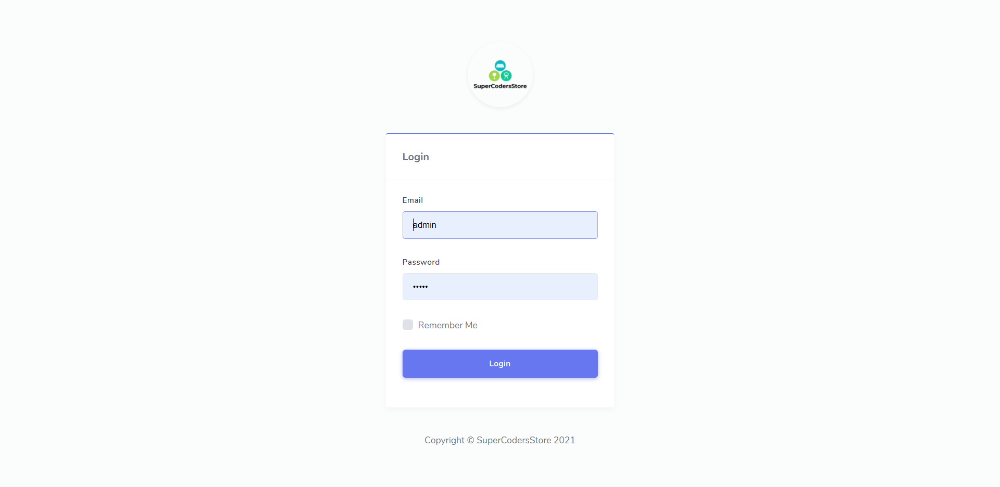

## Added Admin Category List Page
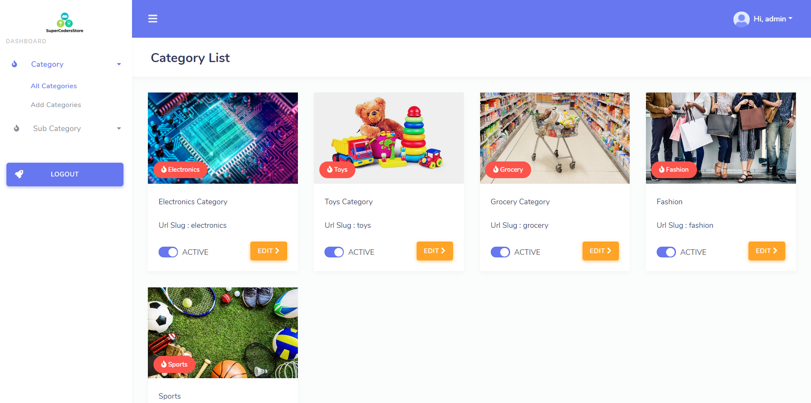

## Added Admin Category Create Page
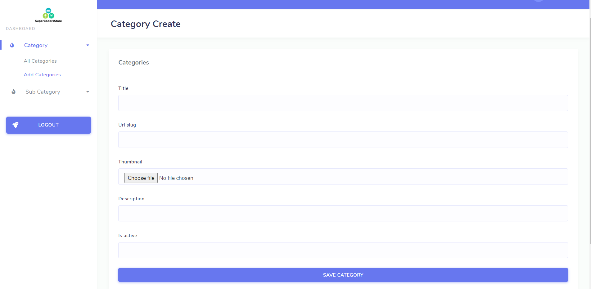

## Added Admin Category Update Page
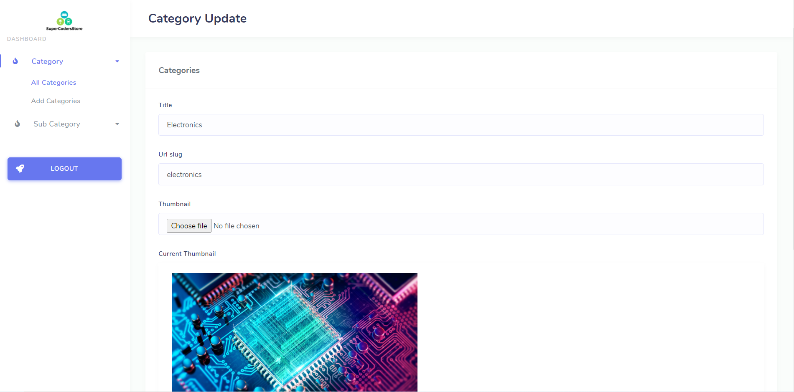

## Added Admin Sub Category List Page
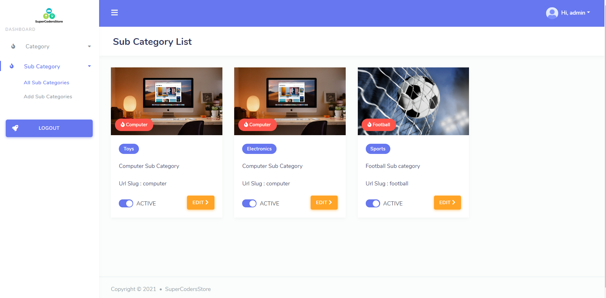

## Added Admin Sub Category Create Page
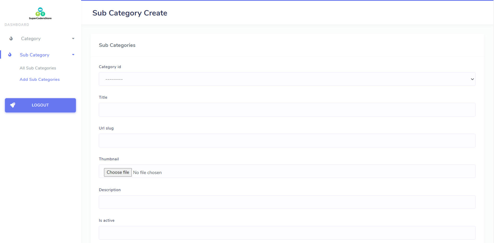

## Added Admin Sub Category Update Page

## Added Admin Merchant Update Page
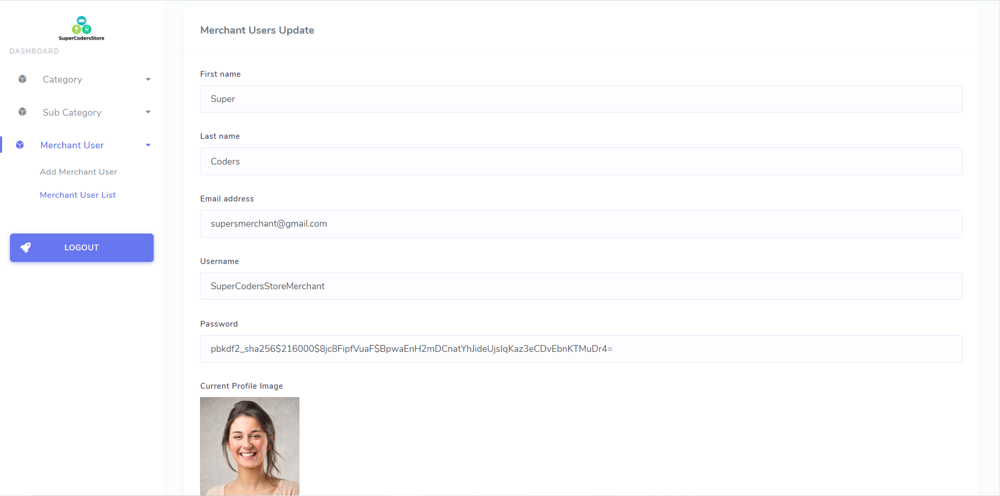

## Added Admin Merchant Create Page
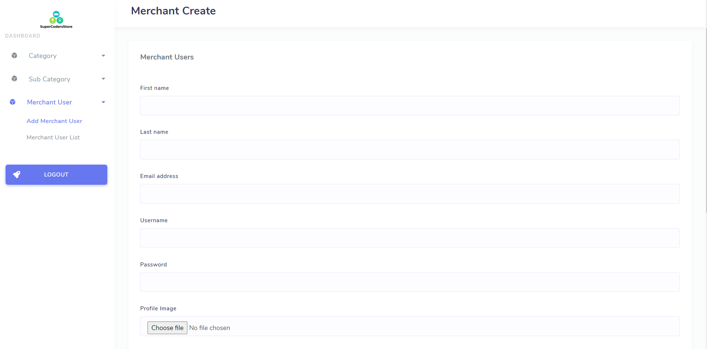

## Added Admin Merchant List Page
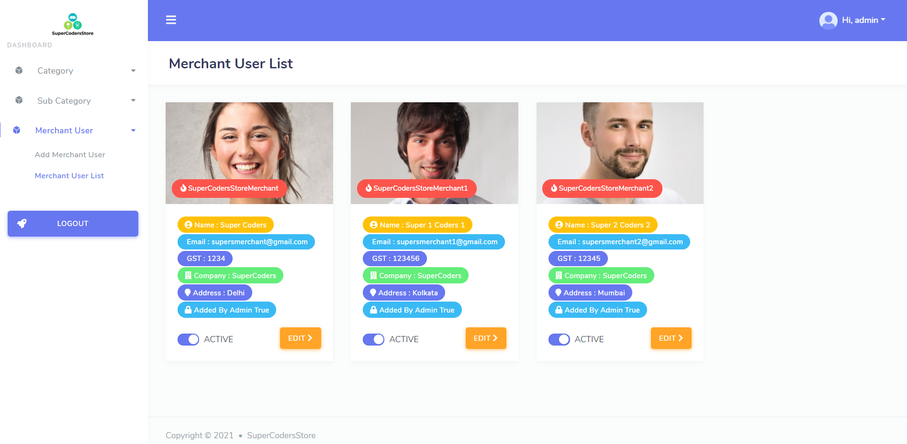

## Added Searching Sorting and Pagination Features
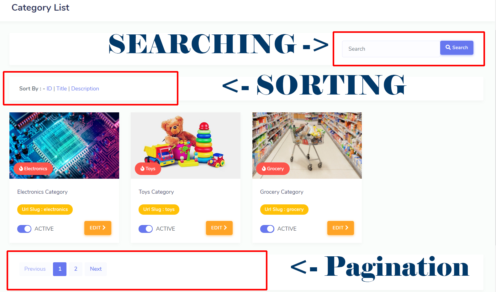

## Added Add Product Page With Dynamic Content and Media
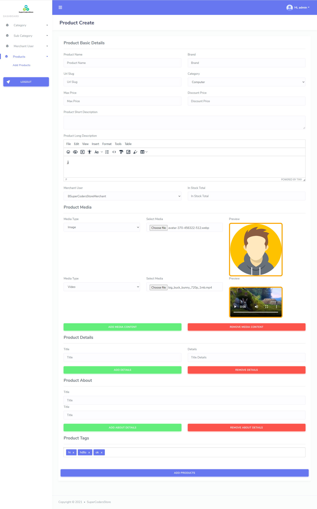

